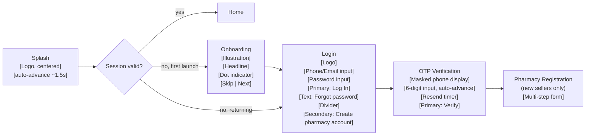

# PharmEx — UI/UX Design System

Scope: product design system only — no React/Flutter/HTML/CSS or implementation code. Builds on top of the database (Task 1) and backend API (Task 2) without altering either. Target platforms: Android, iOS (via PWA/wrapped shell), and Web (buyer/seller PWA + desktop Admin panel).

---

## 1. Design System

### 1.1 Design Principles

- **Pharmacy-grade trust**: clean, clinical, uncluttered — closer to a banking/health app than a consumer marketplace. Nothing playful or noisy.
- **Speed over decoration**: pharmacists are working under time pressure; every screen prioritizes scan-ability (price, quantity, expiry, status) over visual flourish.
- **Legibility first**: this is a numbers-and-dates-heavy domain (prices, batch numbers, expiry dates, quantities) — typography and contrast choices favor unambiguous reading over branding personality.
- **Consistency over cleverness**: one button style, one card pattern, one status-chip system, reused everywhere, so a pharmacist who learns one screen already knows the next.

### 1.2 Color Palette

**Brand**
| Token | Light hex | Usage |
|---|---|---|
| `primary` | `#0F766E` (teal-700) | Primary actions, active nav, links — teal reads clinical/medical without being a generic "medical blue" |
| `primary-hover` | `#0B5A54` | Pressed/hover state |
| `primary-subtle` | `#E6F4F2` | Selected chip backgrounds, subtle highlights |
| `secondary` | `#1E3A5F` (deep navy) | Secondary emphasis, admin panel accents |

**Semantic**
| Token | Hex | Usage |
|---|---|---|
| `success` | `#15803D` | Verified, delivered, in-stock, accepted |
| `warning` | `#B45309` | Short expiry, pending review, low stock |
| `danger` | `#B91C1C` | Expired, rejected, out-of-stock, destructive actions |
| `info` | `#1D4ED8` | Informational banners, new listing badges |

**Neutrals** (used for text, surfaces, borders — the majority of the UI)
| Token | Light hex | Dark hex |
|---|---|---|
| `surface-base` | `#FFFFFF` | `#0F1416` |
| `surface-raised` | `#F8FAF9` | `#171D1F` |
| `surface-sunken` | `#F1F4F3` | `#0A0D0E` |
| `border-subtle` | `#E2E8E6` | `#2A3234` |
| `border-strong` | `#CBD5D3` | `#3A4547` |
| `text-primary` | `#0F1B19` | `#EDF2F1` |
| `text-secondary` | `#4B5D5A` | `#A6B5B2` |
| `text-disabled` | `#96A6A3` | `#5C6A67` |

**Rationale**: a desaturated teal/navy/neutral system rather than saturated brand colors keeps status chips (red/amber/green) unambiguous — they never compete visually with the brand color, which matters a lot when "red = expired stock" needs to be instantly readable.

### 1.3 Typography

- **Typeface**: a single geometric-humanist sans (e.g. Inter or IBM Plex Sans) for UI text; a **tabular-figure variant** enforced for all numeric fields (prices, quantities, dates) so columns of numbers align — critical for inventory/order tables.
- Bengali-language UI support: pair with a matching Bengali-script family (e.g. Noto Sans Bengali) sharing similar x-height/weight so mixed EN/BN labels don't look mismatched — relevant since the seller's other apps run a Bengali UI.

| Token | Size / Line-height | Weight | Usage |
|---|---|---|---|
| `display` | 28 / 36 | 700 | Splash/onboarding headlines only |
| `h1` | 22 / 28 | 700 | Screen titles |
| `h2` | 18 / 24 | 600 | Section headers, card group titles |
| `h3` | 16 / 22 | 600 | Card titles, dialog titles |
| `body-lg` | 15 / 22 | 400 | Primary reading text |
| `body` | 14 / 20 | 400 | Default UI text |
| `body-sm` | 13 / 18 | 400 | Secondary/meta text (timestamps, batch numbers) |
| `caption` | 12 / 16 | 500 | Labels, chip text, table headers |
| `numeric-price` | 16 / 22 | 600, tabular-nums | Prices, always right-aligned in lists/tables |

### 1.4 Spacing System

8pt base grid: `4, 8, 12, 16, 24, 32, 48, 64` (tokens `space-1` through `space-8`). `space-2` (8px) is the default gap between related elements; `space-4` (16px) is the default screen edge padding on mobile; `space-6` (32px) separates major sections.

### 1.5 Grid System

| Breakpoint | Width | Columns | Margin | Gutter |
|---|---|---|---|---|
| Mobile | 0–599px | 4 | 16px | 8px |
| Tablet | 600–1023px | 8 | 24px | 16px |
| Desktop (Admin) | 1024px+ | 12 | 32px, max content width 1280px centered | 24px |

### 1.6 Icons

- Single icon set throughout (outline style, 24×24 base grid, 2px stroke) — e.g. Phosphor or Lucide — never mix filled and outline icons within the same screen.
- Filled variant of the same set reserved exclusively for **active/selected states** (e.g. active bottom-nav tab) so "filled = currently selected" becomes a learned, consistent signal.
- Domain-specific icon needs: capsule/tablet glyph (medicine), storefront (pharmacy), clock-alert (expiry), truck (shipment), chat-bubble, receipt (order), shield-check (verified).

### 1.7 Elevation & Shadows

| Token | Usage | Shadow (light theme) |
|---|---|---|
| `elevation-0` | Flat content, list rows | none, `border-subtle` only |
| `elevation-1` | Cards, resting | `0 1px 2px rgba(15,27,25,0.06)` |
| `elevation-2` | Raised cards on hover/press, dropdowns | `0 2px 8px rgba(15,27,25,0.10)` |
| `elevation-3` | Bottom sheets, FAB | `0 4px 16px rgba(15,27,25,0.14)` |
| `elevation-4` | Dialogs, modals | `0 8px 32px rgba(15,27,25,0.18)` |

Dark theme uses the same elevation *steps* but signals elevation via a lightened surface color (`surface-raised` vs `surface-base`) plus a subtle border, since shadows read poorly on dark backgrounds.

### 1.8 Border Radius

| Token | Value | Usage |
|---|---|---|
| `radius-sm` | 6px | Chips, badges, small buttons |
| `radius-md` | 10px | Cards, input fields, buttons |
| `radius-lg` | 16px | Bottom sheets, dialogs, image thumbnails |
| `radius-full` | 999px | Pills, avatars, status dots |

### 1.9 Light & Dark Theme

Both themes share identical semantic tokens (`primary`, `success`, `warning`, `danger`, spacing, radius) — only the neutral surface/text/border values swap (Section 1.2 table). This means every component is specified once against semantic tokens, never against raw hex values, so theme switching is a token-substitution problem, not a redesign. Dark theme desaturates semantic colors slightly (e.g. `success` shifts from `#15803D` to `#34D399`) to avoid vibrating against a near-black background while staying distinguishable from `danger`/`warning` for colorblind users when paired with icons (see Accessibility).

---

## 2. Component Library

Each component below is specified by anatomy, states, and usage rules — not code.

### Buttons
- **Variants**: Primary (filled, `primary` color), Secondary (outlined, `border-strong`), Tertiary/Text (no border, `primary` text), Destructive (filled, `danger`).
- **Sizes**: Large (48px height, primary CTAs like "Place Order"), Medium (40px, default), Small (32px, inline table actions).
- **States**: default, hover (desktop only), pressed, disabled (40% opacity, no shadow), loading (spinner replaces label, button stays same width to prevent layout shift).
- Rule: exactly one Primary button visible per screen/section — never two competing filled buttons side by side.

### Cards
- **Listing Card** (see Section 3 for full anatomy): image, medicine name, pharmacy name + distance, price, quantity/MOQ, expiry chip.
- **Info Card**: generic container, `elevation-1`, `radius-md`, `space-4` internal padding — used for dashboard stat blocks, order summaries.
- **Interactive Card**: adds pressed state (`elevation-2` + slight scale 0.98) when the whole card is tappable.

### Search Bar
- Persistent, sticky under the top app bar on Home/Search screens.
- Anatomy: leading search icon, placeholder text ("Search medicines, brands..."), trailing filter icon with a badge dot when filters are active, voice-search icon (optional, future).
- Tapping opens a full-screen search state with recent searches + live suggestions (typeahead), not an inline dropdown, on mobile; inline dropdown on desktop.

### Filters
- Mobile: bottom sheet triggered from the search bar's filter icon — grouped sections (Category, Price Range slider, Distance, Dosage Form, Sort By) with a sticky "Apply (N results)" button showing live count.
- Desktop/Admin: persistent left-rail filter panel instead of a sheet.
- Active filters render as removable Chips in a horizontal scroll strip below the search bar.

### Input Fields
- Anatomy: label (always visible above field, never placeholder-only — placeholders disappear on typing and hurt usability for form-heavy KYC flows), input, helper/error text below, optional leading/trailing icon.
- States: default, focused (`primary` border, 2px), error (`danger` border + icon + message), disabled, read-only (used for price fields snapshotted on confirmed orders).
- Specialized variants: currency input (fixed currency prefix, tabular numeric), date picker (calendar sheet, disallows past dates for expiry fields), quantity stepper (−/+ buttons flanking a numeric field, respects MOQ as the floor).

### Dropdowns / Selects
- Standard select (bottom sheet on mobile, popover on desktop) for single-choice (category, dosage form).
- Multi-select variant shows chosen count as a badge on the trigger ("Category (3)").
- Searchable variant for long lists (Company, Medicine picker when creating a listing).

### Chips
- **Filter chip**: toggle state, `radius-full`, outline default / filled `primary-subtle` when active.
- **Status chip**: non-interactive, filled background using semantic color at 12% opacity + full-opacity text/icon of the same hue (e.g. Verified = `success` text+icon on pale green fill). Always icon + label, never color alone (accessibility).

### Bottom Navigation (mobile buyer/seller app)
- 5 destinations max: **Home, Search, Cart/Requests (badge count), Chat (badge count), Profile**. Seller-mode swaps "Cart" for a **Dashboard** icon contextually (see Navigation section).
- Active tab: filled icon + `primary` color + label always visible (never icon-only nav — reduces cognitive load for a professional/utility app).

### Top App Bar
- Standard: back/menu icon, screen title, up to 2 trailing action icons (e.g. notification bell with badge, search).
- Large/collapsing variant on Home only (title shrinks on scroll to reclaim vertical space for the feed).

### Floating Action Button (FAB)
- Single use case: **"+ Add Listing"** on the Seller Inventory screen. Extended FAB (icon + label) on first visit to a section, collapses to icon-only after scroll.
- Never more than one FAB per screen; never used for destructive or secondary actions.

### Dialogs
- Confirmation dialogs (e.g. "Reject buy request?") always show consequence text and two actions (Cancel = tertiary, Confirm = Primary or Destructive depending on action).
- Full-screen dialogs (mobile) for multi-step flows entered from a card (e.g. "Respond to Buy Request").

### Snackbars
- Bottom-anchored, auto-dismiss 4s, one optional action ("Undo"). Used for reversible/low-stakes confirmations (item added to cart, listing paused). Never used for errors that require the user's attention — those use inline error states or dialogs instead.

### Tables (primarily Seller Inventory/Orders and Admin)
- Responsive strategy: full table on desktop/tablet; **collapses to a stacked card-per-row layout on mobile** (each "row" becomes a card with label:value pairs) rather than horizontal-scrolling a cramped table.
- Sticky header row on scroll (desktop), sortable column headers with a subtle sort-direction icon, zebra-free (rely on `border-subtle` row dividers, not background banding, to stay calm on dense data).

### Badges
- Small numeric/dot indicator on icons (nav items, notification bell, chat) — dot only if count is 0<n but not needed, numeral up to 99, then "99+".

### Status Labels
Standardized chip vocabulary reused everywhere an entity has a lifecycle state, so a color+icon always means the same thing across the whole app:

| State | Color | Icon |
|---|---|---|
| Verified / Delivered / Completed / Accepted | `success` | check-circle |
| Pending / Under Review / Processing | `warning` | clock |
| Rejected / Cancelled / Expired / Failed | `danger` | x-circle |
| Draft / Paused | neutral (`text-secondary` on `surface-sunken`) | pause / pencil |
| New / Info | `info` | sparkle / info-circle |

### Empty States
- Anatomy: simple line illustration (not a stock photo), 1-line headline, 1-line supporting text, one Primary action where applicable (e.g. empty Inventory → "Add your first listing").
- Never just blank space or a generic "No data" — always contextual to the screen (empty Cart, empty Search results, empty Chat list each get distinct copy).

### Loading States
- Full-screen loads: centered spinner only for very first app load (splash-adjacent); everywhere else, prefer Skeleton Loaders over spinners so layout doesn't jump.
- Inline/button loading: spinner replaces label inside the button, button width locked.
- Pull-to-refresh on all feed/list screens (Home, Inventory, Orders, Chat list).

### Skeleton Loaders
- Match the exact geometry of the content they replace (card-shaped skeleton for listing cards, row-shaped for table rows) using a subtle shimmer animation on `surface-sunken`.
- Used on: Home feed, Search results, Listing Details, Inventory table, Orders list, Chat message history, Analytics charts (skeleton bars before data resolves).

---

## 3. Screens

### 3.1 Information Architecture

```mermaid
flowchart TD
    Root[App Root]
    Root --> Unauth[Unauthenticated]
    Root --> Auth[Authenticated]

    Unauth --> Splash --> Onboarding --> Login --> OTP[OTP Verification]
    OTP --> PharmOnboard[Pharmacy Registration\n+ Document Upload]
    PharmOnboard --> PendingReview[Verification Pending Screen]

    Auth --> Home
    Auth --> Search
    Auth --> CartOrReq[Cart / Buy Requests]
    Auth --> ChatSection[Chat]
    Auth --> Profile

    Home --> Feed[Marketplace Feed]
    Home --> Featured[Featured Deals]
    Home --> ShortExpiry[Short Expiry Deals]
    Feed --> ListingDetails[Medicine / Listing Details]
    ListingDetails --> SellerProfile[Seller Profile]
    ListingDetails --> AddToCart

    CartOrReq --> Cart
    Cart --> Checkout
    Checkout --> BuyRequestSent[Buy Request Sent]
    CartOrReq --> BuyRequestsList[Buy Requests List]
    BuyRequestsList --> BuyRequestDetail
    Auth --> OrderHistory[Order History]
    OrderHistory --> OrderDetail

    ChatSection --> ConversationList
    ConversationList --> ChatScreen
    ChatScreen --> MediaViewer

    Auth --> Notifications

    Profile --> EditProfile
    Profile --> SellerDashboard[Seller Dashboard\n(if pharmacy owner)]
    Profile --> Settings

    SellerDashboard --> DashboardHome
    SellerDashboard --> Inventory
    Inventory --> AddListing
    Inventory --> EditListing
    SellerDashboard --> SellerOrders[Orders - Seller View]
    SellerDashboard --> Analytics

    Root --> AdminWeb[Admin Web Panel - desktop]
    AdminWeb --> AdminDash[Admin Dashboard]
    AdminWeb --> AdminVerification[Pharmacy Verification Queue]
    AdminWeb --> AdminReports[Reports Queue]
    AdminWeb --> AdminUsers[User Management]
    AdminWeb --> AdminAnalytics[Platform Analytics]
```

### 3.2 Screen List

| Section | Screens |
|---|---|
| Auth | Splash, Onboarding (3-slide carousel), Login, OTP Verification, Pharmacy Registration, Document Upload, Verification Pending |
| Home | Marketplace Feed, Featured Deals, Short Expiry Deals, Search (full-screen), Search Results + Filters |
| Medicine | Listing Card (component, appears in feeds/search), Medicine Details, Seller Profile |
| Seller | Dashboard Home, Add Listing, Edit Listing, Inventory List, Orders (seller view), Buy Requests Inbox, Analytics |
| Buyer | Cart, Checkout, Buy Requests List, Buy Request Detail, Order History, Order Detail |
| Chat | Conversation List, Chat Screen, Media Viewer |
| Notifications | Notification Feed |
| Profile/Settings | Profile View, Edit Profile, Settings (language, theme, notification prefs, business hours, security/sessions) |
| Admin (desktop-first) | Admin Dashboard, Pharmacy Verification Queue, Verification Detail, Reports Queue, Report Detail, User Management, Medicine Moderation Queue, Platform Analytics, Config |

### 3.3 Key Screen Wireframes

**Splash / Onboarding / Login / OTP**


**Marketplace Feed (Home)**
```
┌ Top App Bar: [≡] PharmEx        [🔔³] ┐
├ Search Bar: [🔍 Search medicines...] [⚙︎] ┤
├ Quick filter chips: All | Nearby | New | Discounted ┤
├─ Section: Featured Deals (horizontal scroll cards) ─┤
├─ Section: ⏰ Short Expiry Deals (horizontal, amber-accented) ─┤
├─ Section: Recently Viewed (horizontal, if any) ─┤
├─ Section: Browse by Category (icon grid, 4 cols) ─┤
├─ Section: For You / All Listings (vertical grid, 2 cols mobile) ─┤
│   [Listing Card] [Listing Card]                     │
│   [Listing Card] [Listing Card]  ... infinite scroll │
└ Bottom Nav: Home | Search | Cart(²) | Chat(¹) | Profile ┘
```

**Listing Card anatomy** (the single most-repeated component in the app):
```
┌────────────────────────────┐
│ [Medicine image, 1:1]      │  ← top-right overlay: discount % badge if any
│                             │
│ Napa Extra 500mg            │  medicine name, h3, 2-line max, ellipsis
│ 10x10 Strip · Beximco        │  body-sm, text-secondary
│ ⭐4.6 City Pharmacy · 2.3km  │  seller mini-row, tappable → Seller Profile
│ ৳120.00  ̶৳̶1̶5̶0̶.̶0̶0̶  −20%      │  numeric-price + strikethrough original
│ MOQ 10 · 500 available       │  caption
│ [Expiry: 8 months ▸ safe]    │  status chip, color-coded by proximity
└────────────────────────────┘
```
Expiry chip coloring: `success` if >6 months, `warning` if 1–6 months ("short expiry" territory — this is also what feeds the Short Expiry Deals rail), `danger` if <1 month (and such listings are flagged for possible restriction/clearance-only labeling per business rules, though that's a backend policy decision, not a design one).

**Medicine Details**
```
┌ Top App Bar: [←]                    [♡] [⤴] ┐
├ Image carousel (swipeable, dot indicator) ┤
├ Medicine name (h1) + brand/company        ┤
├ Price block: current price large, MOQ, available qty ┤
├ Expiry + batch info row (status chip)     ┤
├ [Quantity Stepper]  [Primary: Add to Cart] ┤
├ Seller card (tappable → Seller Profile): logo, name, rating, distance, verified badge ┤
├ Tabs: Details | Composition | Similar Listings ┤
├   Details tab: dosage form, pack size, category, schedule class ┤
├   Similar Listings tab: other sellers of same medicine, sorted by price ┤
└ Sticky bottom bar (mobile): [Chat with Seller] [Add to Cart] ┘
```

**Seller Dashboard Home**
```
┌ Top App Bar: PharmEx Seller          [🔔] ┐
├ Verification status banner (if not yet verified) ┤
├ Stat cards row (scroll on mobile, grid on tablet+):
│   [Today's Sales ৳X] [Pending Buy Requests: N] [Active Listings: N] [Rating ⭐4.6] ┤
├ Section: Pending Buy Requests (list, quick Accept/Reject) ┤
├ Section: Short Expiry Alert (your listings expiring soon → CTA to discount/clear) ┤
├ Section: Recent Orders (compact list, tap → Order Detail) ┤
├ Quick actions: [+ Add Listing] [View Inventory] [View Analytics] ┤
└ Bottom Nav (seller mode): Dashboard | Inventory | Requests(²) | Chat(¹) | Profile ┘
```

**Add / Edit Listing** (multi-step form on mobile, single scrolling form on tablet+)
```
Step 1 — Select Medicine: [Search existing medicine] or [+ Add new medicine to catalog]
Step 2 — Batch Details: Batch Number, Mfg Date (picker), Expiry Date (picker, validated > Mfg Date)
Step 3 — Pricing & Stock: Purchase Price (private), Selling Price, Discount %, computed Final Price (live preview), Available Qty, MOQ, Unit
Step 4 — Review & Publish: summary card exactly matching the buyer-facing Listing Card, [Save as Draft] [Publish]
```
Design note: Step 4 deliberately renders the *exact* Listing Card component the buyer will see — sellers should never be surprised by how their listing looks live.

**Cart**
```
┌ Top App Bar: Cart                    ┐
├ Grouped by seller (collapsible sections):
│  ┌ Seller: City Pharmacy (3 items)  [Chat] ┐
│  │  [thumb] Medicine name  Qty[-5+]  ৳600  🗑 │
│  │  ...                                       │
│  │  Subtotal: ৳1,850   [Send Buy Request →]   │
│  └───────────────────────────────────────────┘
│  ┌ Seller: MedPlus Pharma (1 item)   [Chat] ┐
│  │  ...                                       │
│  └───────────────────────────────────────────┘
└ (Each seller group sends its own Buy Request — no single "checkout all" button, since sellers negotiate independently) ┘
```

**Chat Screen**
```
┌ Top App Bar: [←] [Pharmacy avatar] Pharmacy Name  [i] ┐
├ (if order/listing-linked) Context banner: "Re: Order #ORD-2026-000123" [View Order ▸] ┤
├ Message list (bubbles: sent right/primary, received left/neutral) ┤
│   Text bubble / Image bubble (tap → Media Viewer) / Voice bubble (waveform + play) ┤
│   Timestamp + read receipt (✓✓) on own messages ┤
├ Input bar: [🎤 hold to record] [📎 attach] [text input] [➤ send] ┤
```

**Order History / Order Detail**
- History: filterable list (status chips as filter tabs: All | Active | Delivered | Cancelled), each row = compact card (order #, counterparty, total, status chip, date).
- Detail: vertical status stepper (Created → Confirmed → Packed → Shipped → Delivered) with timestamps, line items table, payment status, [Chat with counterparty], [Cancel] (if eligible), [Leave Review] (post-delivery).

**Admin Dashboard (desktop-first, responsive down to tablet, not optimized for phone)**
```
┌ Left rail: Dashboard | Verification Queue | Reports | Users | Medicines | Analytics | Config ┐
├ Top bar: search, admin avatar, notifications ┤
├ Main: KPI cards row (GMV, Active Pharmacies, Pending Verifications, Open Reports) ┤
├ Two-column: [Verification Queue table] | [Reports Queue table] ┤
├ Chart row: Orders over time, Top medicines by sales ┤
```

### 3.4 Core User Flows

**Buyer purchase flow**: Home → Listing Details → Add to Cart (repeat across sellers) → Cart → Send Buy Request (per seller) → Buy Request Detail (pending) → push notification on seller response → Order created (if accepted) → Order Detail → status updates → Delivered → Leave Review.

**Seller onboarding flow**: Register (email/phone + password) → OTP Verify → Pharmacy Registration form → Upload Documents (license, GST, PAN) → Verification Pending screen (with expected-turnaround copy) → push notification on admin decision → if approved, full app access unlocked (Add Listing FAB becomes active); if rejected, Pending screen shows reason + re-submit CTA.

**Buy request negotiation flow (seller side)**: Notification → Buy Requests Inbox → Request Detail (shows buyer, items, quantities) → Accept (stock auto-reserved→confirmed) or Reject (with optional note) → both parties notified → on Accept, Order auto-created and both land on Order Detail.

---

## 4. Navigation

```mermaid
flowchart TD
    subgraph MobileNav["Mobile Bottom Navigation (5 tabs, adapts by role)"]
        direction LR
        N1[Home] --- N2[Search] --- N3["Cart/Requests\n(buyer) or\nDashboard\n(seller)"] --- N4[Chat] --- N5[Profile]
    end

    subgraph SellerModeToggle["Role Switch"]
        Profile --> ToggleMode["Switch to Seller Mode\n(if pharmacy verified)"]
        ToggleMode --> SellerNav["Bottom Nav becomes:\nDashboard | Inventory | Requests | Chat | Profile"]
    end

    subgraph DesktopAdmin["Admin Web — Left Rail, always visible"]
        direction TB
        D1[Dashboard]
        D2[Verification Queue]
        D3[Reports]
        D4[Users]
        D5[Medicines]
        D6[Analytics]
        D7[Config]
    end
```



- **Buyer/seller are the same account and same app** — a verified pharmacy owner sees a persistent **mode toggle** in Profile ("Buying" / "Selling") since the same pharmacy frequently does both; switching mode swaps the bottom nav's 3rd tab and Home feed emphasis, not the whole app.
- **Deep links**: every push notification maps to a specific screen + entity id (`order/{id}`, `conversation/{id}`, `buyrequest/{id}`) so tapping a notification never lands on a generic list.
- **Back-stack rules**: modal/sheet flows (filters, add-to-cart quantity picker) dismiss with swipe-down or explicit close, never consume the Android hardware back stack in a way that surprises the user; multi-step forms (Add Listing, Pharmacy Registration) use an in-form step-back, with a confirmation dialog if backing out of a partially-filled form.
- **Admin panel is a fully separate navigation shell** (persistent left rail, not bottom nav) since it's desktop-first and used in longer working sessions, not quick mobile checks.

---

## 5. Responsive Layout

| Context | Layout behavior |
|---|---|
| **Mobile (phone, 0–599px)** | Single column, bottom nav, sheets for filters/pickers, cards stack vertically, tables → stacked cards |
| **Tablet (600–1023px)** | Two-column where content allows (Listing grid → 3 cols, Dashboard stat cards → 2x2 grid), bottom nav retained for buyer/seller app (still primarily a touch, one-handed context), side-by-side master-detail for Chat (conversation list + open chat) when width allows |
| **Desktop / Admin (1024px+)** | Left rail navigation replaces bottom nav, multi-column dashboards, tables shown in full (no card-collapse), max content width 1280px centered with generous margins, hover states active |
| **Buyer/Seller PWA on desktop browser** | Same information architecture as tablet, with a persistent left rail (mirroring Admin's pattern) instead of bottom nav once viewport ≥1024px, since a mouse+keyboard session benefits from always-visible nav |

Breakpoints reuse the Grid System tokens (Section 1.5) as the single source of truth — no ad-hoc breakpoints introduced elsewhere.

---

## 6. Accessibility

- **Large text support**: all type tokens (Section 1.3) specified in scalable units; layouts tested/designed to reflow (not truncate/clip) up to 200% system text scale — critical for the Listing Card and Order stepper, which are text-dense.
- **Color contrast**: every text/background pairing in both themes meets WCAG AA (4.5:1 for body text, 3:1 for large text/icons); status chips always pair color with an icon + text label (never color alone) so the ~8% of male users with red-green colorblindness can still distinguish Verified from Expired.
- **Screen reader support**: every interactive element has a meaningful accessible label (e.g. a Listing Card announces "Napa Extra 500mg, City Pharmacy, 120 taka, 20 percent off, expires in 8 months, add to cart button" rather than reading disconnected fragments); status chips announce their semantic meaning, not just their color; images have alt text sourced from the medicine name.
- **Touch target sizing**: minimum 44×44pt (iOS)/48×48dp (Android) for every tappable element, including icon-only buttons in dense contexts like table row actions — spacing tokens (Section 1.4) enforce adequate gaps between adjacent targets (e.g. Accept/Reject buttons on a buy request row) to prevent mis-taps.
- **Focus order & keyboard navigation** (Admin/desktop web): logical tab order matching visual layout, visible focus rings (not suppressed), all dialogs trap focus and return it on close.
- **Motion**: respect system "reduce motion" setting — skeleton shimmer and page transitions degrade to simple fades/no-animation.

---

## 7. Design Tokens

Representative token set (semantic, theme-agnostic naming — values resolved per Section 1 tables):

```
color.primary
color.primary.hover
color.primary.subtle
color.secondary
color.success / color.warning / color.danger / color.info
color.surface.base / color.surface.raised / color.surface.sunken
color.border.subtle / color.border.strong
color.text.primary / color.text.secondary / color.text.disabled

font.family.default / font.family.bengali
font.size.display / h1 / h2 / h3 / body-lg / body / body-sm / caption / numeric-price
font.weight.regular(400) / medium(500) / semibold(600) / bold(700)
font.lineHeight.[matches each size token]

space.1 (4) / space.2 (8) / space.3 (12) / space.4 (16) / space.5 (24) / space.6 (32) / space.7 (48) / space.8 (64)

radius.sm (6) / radius.md (10) / radius.lg (16) / radius.full (999)

elevation.0 / elevation.1 / elevation.2 / elevation.3 / elevation.4

grid.breakpoint.mobile (0) / tablet (600) / desktop (1024)
grid.columns.mobile (4) / tablet (8) / desktop (12)
grid.margin.mobile (16) / tablet (24) / desktop (32)
grid.gutter.mobile (8) / tablet (16) / desktop (24)

motion.duration.fast (120ms) / default (200ms) / slow (320ms)
motion.easing.standard / decelerate / accelerate

component.touchTarget.min (44)
```

Tokens are structured so a future implementation phase can generate them into any target format (JSON, CSS custom properties, platform-native theme files) without redesign — this document defines the values and their semantic names only.

---

## 8. UX Guidelines

### 8.1 User Flows
Covered in Section 3.4 (Buyer purchase, Seller onboarding, Buy request negotiation). Two additional flows worth standardizing:
- **Search-to-purchase**: Search → live results with facet counts → tap result → Listing Details → Add to Cart, always reachable in ≤3 taps from the search bar.
- **Dispute/report flow**: any listing, message, or pharmacy has a consistent "Report" entry point (overflow menu, `⋮`), opening a short reason-select + description sheet, ending in a confirmation snackbar ("Report submitted, we'll review within 24h") — never a silent submission.

### 8.2 Empty States (contextual copy per screen, not generic)
- Empty Cart: "Your cart is empty" + "Browse Medicines" primary action.
- Empty Search Results: "No results for '{query}'" + suggested filter relaxation ("Try removing the price filter").
- Empty Inventory (new seller): "You haven't listed any medicines yet" + "+ Add Your First Listing".
- Empty Chat: "No conversations yet — messages with buyers and sellers will appear here."
- Empty Buy Requests: distinct copy for buyer ("You haven't sent any requests") vs seller ("No incoming requests yet").

### 8.3 Error States
- **Inline field errors**: appear on blur/submit directly under the field, red text + icon, field border turns `danger`.
- **Action failures** (e.g. "Accept Buy Request" fails because stock changed): a dialog, not a snackbar, since it needs the user to acknowledge and possibly re-decide — snackbars are reserved for reversible/low-stakes feedback only.
- **Network/connectivity errors**: a persistent top banner ("You're offline — showing cached data") rather than blocking the whole screen, since read-only browsing of cached listings should still work.
- **Full-screen error** (e.g. failed to load Order Detail): illustration + "Something went wrong" + [Retry], reserved for cases where there's genuinely no partial content to show.

### 8.4 Success States
- Immediate, lightweight confirmation for low-stakes actions (snackbar: "Added to cart").
- Explicit confirmation screens/dialogs for high-stakes or terminal actions (Buy Request sent, Order placed, Pharmacy registration submitted) — these get a dedicated confirmation screen with a summary and clear "what happens next" copy, not just a toast, because the user is about to leave the flow and needs closure.

### 8.5 Loading Experience
- First app open: brief branded Splash (≤1.5s), never a spinner-only blank screen.
- Any list/feed: Skeleton Loaders matching final content shape (Section 2), not spinners — reduces perceived wait and prevents layout jump.
- Actions with server round-trips (Add to Cart, Send Buy Request, Accept/Reject): inline button loading state (Section 2), UI remains interactive elsewhere, optimistic UI only where safe to roll back (e.g. cart quantity, not stock-affecting actions like buy-request accept).
- Long operations (bulk inventory import, if added later): progress bar with a determinate percentage, not indefinite spinner, plus the ability to navigate away and get a completion notification.

---

## 9. Output Summary

- **Information Architecture**: Section 3.1 (Mermaid tree).
- **Screen List**: Section 3.2 (full inventory by domain).
- **Wireframes**: Section 3.3 (ASCII/box wireframes for the highest-traffic screens: Auth flow, Home Feed, Listing Card, Medicine Details, Seller Dashboard, Add Listing, Cart, Chat, Order Detail, Admin Dashboard) plus flow diagrams (Mermaid) for Auth and Navigation.
- **Component Specifications**: Section 2 (18 components with variants/states/usage rules).
- **Navigation Diagram**: Section 4 (Mermaid).
- **UX Notes**: Section 8, plus inline rationale notes throughout (e.g. why Listing Card's Step-4-preview matches the live card exactly, why Cart has no unified checkout button, why Admin uses a rail instead of bottom nav).

---

*This document is a UI/UX design system only, per the task scope. It assumes and does not alter the database (Task 1) or backend API (Task 2). No React, Flutter, HTML, CSS, or other implementation code is included.*
